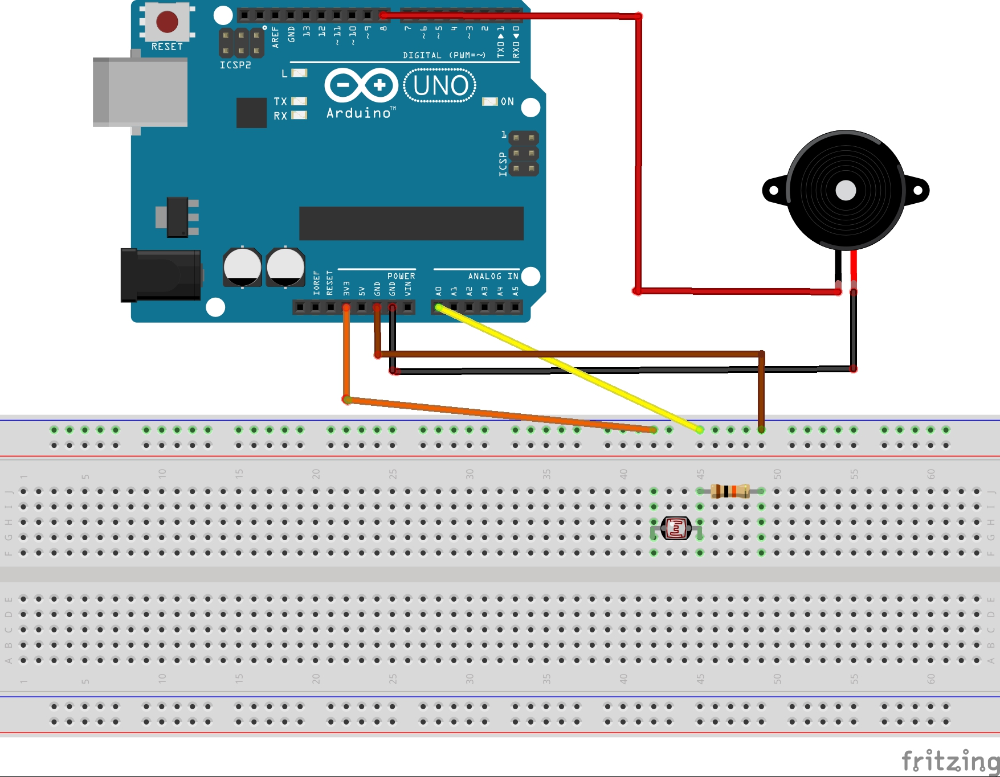

# alarmefrigo

Alarme de Frigo porte ouverte

Ce projet à été réalisé par [@siham](https://github.com/siham87) et [@wildcat](https://github.com/wildcat7534)

## Video :
[](https://www.youtube.com/watch?v=rAtIEVhXILA)

## **Matériel**
+ Arduino
+ Capteur de luminosité
+ Buzzer

## **Montage**



```
void setup() {

Serial.begin(9600);
pinMode(8,OUTPUT);
}

void loop() {
  
  int lumiere = analogRead(0);

  Serial.println("lumiere : ");
  Serial.println(lumiere);
  delay(1000);
  digitalWrite(8,LOW);
  
  if(lumiere > 300){

    int lumiere = analogRead(0);
    delay(5000);
    lumiere = analogRead(0);
  
      if(lumiere > 300){
      Serial.println("alarm");
      digitalWrite(8,HIGH);
      lumiere = analogRead(0);
      }
  
}
}
```

